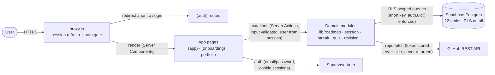

# Cyber_Path

    

> A personal cybersecurity learning command center: a structured roadmap with prerequisites, real timed study sessions, daily missions, streaks, quizzes, spaced revision, projects and career-path guidance — all persisted in a live database. Nothing is simulated.

**Live:** https://cyber-path-phi.vercel.app

---

## Table of contents

- [Overview](#overview)
- [Key features](#key-features)
- [Screenshots / demo](#screenshots--demo)
- [Tech stack](#tech-stack)
- [Architecture](#architecture)
- [Project structure](#project-structure)
- [Getting started](#getting-started)
- [Available scripts](#available-scripts)
- [Database setup](#database-setup)
- [Authentication](#authentication)
- [The learning system](#the-learning-system)
- [Progress & streak system](#progress--streak-system)
- [Quiz & revision system](#quiz--revision-system)
- [Skills & practical learning](#skills--practical-learning)
- [Roadmap content](#roadmap-content)
- [Security](#security)
- [Responsive design & accessibility](#responsive-design--accessibility)
- [Testing](#testing)
- [Deployment](#deployment)
- [Roadmap / future improvements](#roadmap--future-improvements)
- [Contributing](#contributing)
- [License](#license)
- [Author](#author)
- [Acknowledgements / references](#acknowledgements--references)

## Overview

Most cybersecurity roadmaps on the internet are static pages: a list of topics, no order enforcement, no progress, and no feedback loop. Cyber_Path is the opposite — it is a working application that turns a learning roadmap into a **daily practice system**:

- The roadmap is a real dependency graph. Topics stay **locked until their prerequisites are complete**, so you always know what to study next and why.
- Each topic is broken into stages — **learn → practice → test → build** — so ticking a box never means "I skimmed it".
- A **daily mission generator** converts your roadmap position into up to 3 concrete tasks with time estimates, and a focused session runner tracks real study time with pause/resume.
- **Streaks are honest**: a day only counts when you completed a real task or studied at least 15 minutes. Opening the dashboard earns nothing.
- Quizzes, spaced revision, skill evidence and career-path coverage are all computed from your actual activity — the app only ever claims what it can prove.

Built as a personal learning tool, but technically multi-account: every user's data is isolated by Row Level Security, so a deployment works fine for a study group too. It suits students starting from fundamentals, career-switchers who want structure, and anyone who wants accountability without gamification tricks.

## Key features

All of the following are implemented and working:

**Learning core**
- 5-phase cybersecurity roadmap (Orientation → Computer Fundamentals → Operating Systems → Networking → Programming & Scripting) with **27 topics**, prerequisite unlocking, difficulty and time estimates
- Per-topic stage tracking (learn / practice / test / build), confidence self-rating (1–5), and "why it matters" context on every topic
- **Daily mission generator** — deterministic, explainable task selection from your roadmap position (learn, practice, test, review and build tasks, tied to real topics and resources)
- **Study sessions** with a real server-tracked timer: start, pause, resume, complete, skip-with-reason, notes; survives refreshes and returns via a "resume session" flow
- **Skill engine** — 14 skills tracked across five evidence-based levels (not started → learning → practicing → competent → demonstrated)

**Knowledge & retention**
- **Quiz engine** — 81 seeded questions across all 27 topics, **scored server-side** (the answer key never reaches the browser), 70% pass line, per-question explanations, full attempt history; passing a quiz auto-sets the topic's Test stage
- **Spaced revision queue** — completing a topic schedules reviews at 1/3/7/14/30 days (per-user configurable); due reviews feed the dashboard
- **Weak-topic detection** from quiz scores and low confidence ratings

**Accountability & insight**
- **Honest streak engine** — a day qualifies with ≥1 completed task **or** ≥15 minutes of real study; milestones at 1/3/7/14/30/50/100 days
- **Missed-day reporting** — record why a day was missed; the app responds with empathetic, deterministic accountability messages (no taunting, no guilt trips)
- **Learning analytics** — daily/weekly study time, velocity, quiz stats, missed-day patterns, revision outlook, weakest-skill view
- **Smart recommendations** — a transparent, weighted engine (every suggestion shows the evidence behind it, e.g. "review 2 days overdue", "on your SOC path this unblocks X")
- **Career paths** — 6 seeded role paths (SOC Analyst, Penetration Tester, Web AppSec, DFIR, Cloud Security, Security Engineer) with coverage computed against your real skill/topic/project evidence — framed as evidence, never job promises

**Platform**
- Email/password **authentication** (Supabase Auth) with first-run onboarding wizard (goal, timezone, schedule, target roles)
- **Resource library** — curated external links per topic with save/done/skip status tracking
- **Notes & bookmarks** per topic, persisted server-side
- **Projects tracker** — 12 seeded project ideas, status pipeline (idea → planned → in progress → done), GitHub repo links
- **GitHub integration** — OAuth account linking, server-side token storage, a repo grid with a transparent security-relevance heuristic, and an **opt-in public portfolio page** at `/portfolio/[username]`
- **Data export** — download all of your data as JSON from Settings

## Screenshots / demo

Screenshots coming soon. In the meantime, the app is deployed and explorable at **https://cyber-path-phi.vercel.app** — sign-up takes under a minute.

## Tech stack

| Layer | Technology |
| --- | --- |
| Framework | Next.js 16 (App Router), React 19 |
| Language | TypeScript (strict mode + `noUncheckedIndexedAccess`) |
| Styling | Tailwind CSS 4 with a semantic design-token system (dark theme) |
| Fonts | Space Grotesk · Inter · JetBrains Mono (self-hosted via Fontsource) |
| Backend | Next.js Server Components + Server Actions (no separate API layer) |
| Database | Supabase (Postgres) — 22 tables, Row Level Security on every one |
| Auth | Supabase Auth (GoTrue) — email/password, cookie sessions |
| External APIs | GitHub REST API (repo + portfolio integration; token held server-side only) |
| Testing | Vitest (12 suites, 117 tests) |
| Linting | ESLint (eslint-config-next) |
| Deployment | Vercel |

## Architecture

Cyber_Path is a single Next.js application with **no hand-rolled API layer**: pages render via Server Components, and every mutation is a Server Action that validates input and derives the user from the server session — never from the client.



Key properties:

- **Pure engines, thin queries.** All learning logic (streaks, revision scheduling, quiz scoring, mission generation, recommendations, career coverage, analytics math) lives in dependency-free TypeScript modules in `src/lib/*` — fully unit-testable with no database or clock. `src/lib/*/queries.ts` and `actions.ts` are thin, RLS-scoped adapters around them.
- **The database is the source of truth.** Session timers tick client-side for display, but start/pause/complete events are persisted immediately, so state survives refreshes, restarts and devices.
- **Timezone-correct days.** "Today" is computed in the user's configured timezone (`lib/session/day.ts`) and stored as a day key, so a 11:55 PM → 12:10 AM session lands on the right day.
- **Defense in depth.** RLS constrains every table to its owner, *and* every query/action additionally filters by the session user.

## Project structure

```text
Cyber_Path/
├── src/
│   ├── app/
│   │   ├── (app)/                 # authenticated app (auth-gated layout)
│   │   │   ├── page.tsx           # dashboard: stats, today's mission, recommendations
│   │   │   ├── roadmap/           # roadmap overview + topic detail ([slug])
│   │   │   ├── session/           # focused study-session runner (TaskRunner.tsx)
│   │   │   ├── skills/            # evidence-based skill levels
│   │   │   ├── library/           # resource library with statuses
│   │   │   ├── projects/          # project tracker
│   │   │   ├── career/            # career paths + coverage ([slug])
│   │   │   ├── github/            # connection, repo grid, portfolio toggle
│   │   │   ├── analytics/         # charts: time, velocity, quiz, missed patterns
│   │   │   ├── history/           # session history + daily calendar
│   │   │   ├── settings/          # profile, goals, timezone, JSON export
│   │   │   └── labs/              # placeholder (planned — see roadmap)
│   │   ├── (auth)/                # login · signup · check-email · forgot/reset password
│   │   ├── (onboarding)/onboarding/  # first-run wizard (goals, timezone, roles)
│   │   ├── portfolio/[username]/  # public, opt-in portfolio page
│   │   ├── icon.svg · robots.ts · sitemap.ts · layout.tsx
│   │   └── error.tsx · global-error.tsx · loading.tsx · not-found.tsx
│   ├── components/
│   │   ├── ui/                    # primitives: Button, Card, Badge, ProgressBar, …
│   │   ├── shell/                 # sidebar, mobile nav, topbar (responsive shell)
│   │   └── quiz/ · streak/ · notes/ · projects/ · career/ · github/ · analytics/ …
│   ├── lib/
│   │   ├── roadmap/               # roadmap queries, actions, skill computation
│   │   ├── session/               # mission generator, timer math, timezone day keys
│   │   ├── streak/                # honest streak engine + accountability messages
│   │   ├── revision/              # spaced-repetition engine (1/3/7/14/30 ladder)
│   │   ├── quiz/                  # server-authoritative scoring engine
│   │   ├── recommend/             # transparent weighted recommendation engine
│   │   ├── career/ · projects/ · analytics/ · github/ · notes/ · resources/
│   │   ├── profile.ts · auth-errors.ts
│   │   └── supabase/              # browser/server/middleware clients + config
│   └── styles/                    # Tailwind 4 theme bridge + design tokens
├── supabase/migrations/           # 18 numbered SQL migrations (schema, RLS, seeds)
├── next.config.ts                 # security headers (CSP, HSTS, X-Frame-Options…)
├── vitest.config.ts · eslint.config.mjs · tsconfig.json
└── package.json
```

## Getting started

### Prerequisites

- **Node.js ≥ 20.9** (required by Next.js 16; `engines` is enforced in `package.json`)
- **npm** (the repo ships a `package-lock.json`)
- **Git**
- A free **[Supabase](https://supabase.com)** project (database + auth)

### Installation

```bash
git clone https://github.com/GhouseNahri/Cyber_Path.git
cd Cyber_Path
npm install
```

### Environment variables

Copy the example file and fill in your Supabase project values:

```bash
cp .env.example .env.local
```

```env
NEXT_PUBLIC_SUPABASE_URL=      # Supabase project URL (Settings → API)
NEXT_PUBLIC_SUPABASE_ANON_KEY= # Supabase anon/public key (Settings → API)
```

- Both values are **public by design** — the anon key is safe for the browser because Row Level Security protects all data.
- The `service_role` key must never be placed in this file or exposed client-side; this app does not use it.
- `.env.local` is git-ignored and never committed.

### Run the development server

```bash
npm run dev
```

Open http://localhost:3000, create an account, and complete the onboarding wizard. All flows work locally exactly as in production.

## Available scripts

| Script | What it does |
| --- | --- |
| `npm run dev` | Start the development server (http://localhost:3000) |
| `npm run build` | Production build (`next build`) |
| `npm run start` | Serve the production build locally |
| `npm run lint` | ESLint across the repo |
| `npm run typecheck` | `tsc --noEmit` — full strict-mode type check |
| `npm run test` | Run the Vitest suite once |

## Database setup

The database is **Supabase Postgres**. The schema, Row Level Security policies, and all seed content live in 18 ordered SQL migrations:

```text
supabase/migrations/
├── 0001_profiles.sql              # profiles + trigger (onboarding data, timezone, goals)
├── 0003_roadmap_schema.sql        # phases, topics, prerequisites, skills, topic progress
├── 0004_seed_roadmap_content.sql  # 5 phases · 27 topics · 14 skills · prerequisite graph
├── 0005_seed_resources.sql        # 22 curated external learning resources
├── 0006_daily_sessions.sql        # study sessions + daily tasks (timezone-aware day keys)
├── 0008_daily_learning_upgrade.sql# task state machine, skip reasons, session notes
├── 0009_missed_days.sql           # missed-day self-reports with reasons
├── 0010_notes_bookmarks.sql       # topic notes + resource bookmarks
├── 0011_revision_queue.sql        # spaced-repetition schedule per topic
├── 0013_quiz_engine.sql           # quizzes, questions, attempts (server-scored)
├── 0014_seed_quiz.sql             # 81 questions covering all 27 topics
├── 0015_projects.sql · 0016_seed_project_ideas.sql   # tracker + 12 ideas
├── 0017_career_paths.sql          # 6 role paths + user selections
└── 0018_github_portfolio.sql      # GitHub connection + public portfolio flag
```

Setup:

1. Create a project at [supabase.com](https://supabase.com) (the free tier is sufficient).
2. Open **SQL Editor** and run the migrations **in ascending order** (0001 → 0018). Each file is idempotent (`if not exists` / `on conflict` upserts), and every migration that creates a table also enables RLS and creates owner-only policies.
3. Copy the project URL and anon key into `.env.local`.

Resetting means dropping the tables (or creating a fresh Supabase project) and re-running the migrations — there is no separate reset script.

## Authentication

Implemented with **Supabase Auth (GoTrue)**, email + password:

- **Sign up** → verification email → `check-email` interstitial → first-run **onboarding wizard** (display name, daily goal, timezone, study time, target roles)
- **Sign in** with cookie-based sessions; `proxy.ts` (Next.js 16's middleware convention) refreshes sessions and **gates every non-public route** — anonymous visits to app pages 307-redirect to `/login`
- **Forgot / reset password** via Supabase's recovery email, with a strict production redirect allow-list
- **Logout** from the user chip in the app shell
- Passwords are handled entirely by Supabase Auth; they never reach this application's code, and no credentials are stored in the app's database

Authorization is enforced twice: every table has owner-only RLS policies (`auth.uid() = user_id`, including `WITH CHECK` on updates), and every Server Action independently derives the user from the server session.

## The learning system

The core concept — everything is one connected graph, not separate features:

```text
Roadmap (5 phases, dependency graph)
  └── Topic (stages: learn → practice → test → build, confidence 1–5)
        ├── Skills (14 skills mapped from topics — evidence builds levels)
        ├── Resources (curated external links, save/done/skip)
        ├── Quiz (server-scored; pass sets the Test stage)
        └── Revision (completing a topic schedules spaced reviews)

Daily mission (generated from roadmap position + due revisions
                + weak topics + career selection)
  └── Tasks: learn · practice · test · review · build
        └── Study session (real timer, pause/resume, notes)
              └── Completing tasks updates topic stages,
                  skill evidence, streaks and analytics
```

- **Mission generation is deterministic and explainable** — scored priority: due revisions → career-aligned topics → in-progress topics → low-confidence reviews → weak-quiz retests → next unlocked topics (career alignment also tie-breaks task selection). Every task carries a "why" line.
- **Progress never comes from clicking.** A topic's stages advance only when the corresponding work happens (a passed quiz for *test*, a completed practice session for *practice*).
- **Recommendations show their evidence** — e.g. "Spaced revision 2 days overdue", "2/4 stages done — the next topic depends on it", "Best quiz score 55% — below the 70% pass line".

## Progress & streak system

- Topic progress = stage completion + self-rated confidence, persisted per user in Postgres (device-independent).
- **A day qualifies for the streak only if** at least one real task was completed **or** at least 15 minutes of closed-session study happened (configurable in `lib/streak/engine.ts`). Opening the app, or starting a timer and abandoning it, never qualifies.
- Streak milestones: 1, 3, 7, 14, 30, 50, 100 days.
- **Missed a day?** The dashboard asks what happened; you pick a reason (no time, too tired, didn't understand, …) and the app responds with a short, empathetic message — varied by reason and day, never manipulative. Missed days also feed analytics (e.g. a suggestion to lower your daily target when the plan is consistently unrealistic).
- All learning days are keyed in the **user's timezone**, so streaks and history stay correct across midnight and travel.

## Quiz & revision system

**Quizzes**
- Multiple-choice knowledge checks seeded per topic (81 questions across all 27 topics)
- **Scored entirely server-side** — the client submits chosen choice IDs only; the answer key never leaves the database
- 70% pass line; passing a quiz automatically sets the topic's **Test** stage
- Every attempt is stored with per-question results and explanations for review; the dashboard surfaces weak topics (best score < 70%) as retest recommendations

**Revision**
- Completing a topic schedules review #1; each completed review schedules the next on a ladder of **1, 3, 7, 14, 30 days** (ladder configurable per user in Settings)
- Due and overdue reviews appear in the revision queue and feed the daily mission and dashboard recommendations
- After the final rung a topic has *graduated* — no more reviews are created

## Skills & practical learning

- 14 skills (Foundations / Systems / Networking / Programming / Security) are mapped from roadmap topics.
- Skill levels are **evidence-based, five tiers**: `not started → learning → practicing → competent → demonstrated` — derived from completed topics (theory weight), practice/build stages, confidence ratings and finished projects. "Practicing" needs real completed topics; "Competent" needs ≥2 completed topics with practical work and no confident rating yet; "Demonstrated" requires a confidence rating of 4+ or a finished project. There is no level inflation.
- The app deliberately separates **learning progress** (topics read, quizzes passed) from **demonstrated ability** (finished projects, GitHub repos) — career-path coverage reads both and says which one is missing.
- **Projects tracker**: 12 seeded project ideas with a status pipeline and GitHub repo links; completing a project strengthens the mapped skills' evidence.
- The **Labs tracker** (provider labs, CTFs, home-lab exercises with evidence) is planned but **not yet implemented** — the Labs page is an explicit placeholder.

## Roadmap content

The learning content (phases, topics, prerequisites, resources, quizzes) was **written originally for this project**. The [GeeksforGeeks Cybersecurity Roadmap](https://www.geeksforgeeks.org/cybersecurity/cybersecurity-roadmap/) was used as a **reference for learning progression and topic ordering only** — no text, design or code is copied from it, and there is no affiliation.

Resources link out to authoritative sources (official documentation, MDN Web Docs, Cloudflare Learning, Microsoft Learn and similar), with attribution carried by each link in the resource library. The roadmap intentionally starts at computer fundamentals — it is *not* "hacking first".

Content currently covers **Phases 0–4** (Orientation through Programming & Scripting); Web Security and later phases are planned content work.

## Security

Security posture, as implemented and audited:

- **Row Level Security on all 22 tables** with owner-only policies (`auth.uid() = user_id`) — including `WITH CHECK` on updates; shared content (roadmap, quizzes) is authenticated-read-only with **no client write paths**
- **Server-authoritative mutations**: every Server Action derives the user from the server session (never accepts a client-supplied `user_id`), validates inputs (length caps, allowlists), and re-checks auth
- **Quiz answers are never exposed to the client**; scoring happens server-side only
- **GitHub provider tokens** are stored server-side only and never returned to any client; only derived, non-secret data reaches the browser
- **Security headers on every response**: Content-Security-Policy (with `frame-ancestors 'none'`, no `unsafe-eval` in production), HSTS, `X-Frame-Options: DENY`, `X-Content-Type-Options: nosniff`, Referrer-Policy, Permissions-Policy
- **Cookie-based auth sessions** refreshed by `proxy.ts`; the public portfolio exposes only whitelisted, opt-in data via a dedicated function
- **Secrets hygiene**: only `.env.example` is tracked; no secrets in source or git history; `npm audit` reports 0 vulnerabilities
- The public anon key is safe to ship by design — RLS is the authorization boundary

### Security considerations / future improvements

- No application-level rate limiting yet (Supabase Auth applies its own throttling); app-level throttling is planned alongside a production domain
- Two-factor authentication is not yet enabled (Supabase supports it; the UI doesn't offer it yet)
- No automated dependency-update workflow (Dependabot/CI) is configured yet

## Responsive design & accessibility

- Responsive layout from 375 px phones to desktop: sidebar collapses to a mobile nav, grids stack, the session runner keeps timer/actions reachable one-handed (verified in a mobile pass)
- **Accessibility**: skip-to-content link, `aria-current` navigation, labelled controls and screen-reader-friendly timer/buttons, visible focus states, semantic HTML, and a `prefers-reduced-motion` media query that disables non-essential animation
- Design tokens enforce consistent contrast across the dark theme

## Testing

- **Vitest** — 12 suites / **117 unit tests**, all passing. The testable cores are the pure engines: streak qualification, spaced-repetition scheduling, quiz scoring, mission generation, recommendations, analytics aggregation, career coverage, project mapping, GitHub repo heuristics, timezone day-key math and timer elapsed-time math, plus accountability-message determinism.
- Type safety is enforced separately with `npm run typecheck` (strict mode + `noUncheckedIndexedAccess`).
- End-to-end flows (signup → onboarding → mission → session → quiz → portfolio) have been verified manually against the live app; an automated E2E layer (e.g. Playwright) is planned.

## Deployment

Deployed on **Vercel**: https://cyber-path-phi.vercel.app

- Framework auto-detected (`next build`); no custom build config required
- The two `NEXT_PUBLIC_SUPABASE_*` variables are set in the Vercel project's environment settings (Production)
- Supabase Auth's URL configuration includes the production domain in its redirect allow-list (signup, recovery and OAuth-linking redirects are built from `location.origin` at runtime)
- To deploy your own instance: push to GitHub, import the repo in Vercel (or `vercel deploy --prod`), and set the environment variables

## Roadmap / future improvements

**Implemented** (everything listed under [Key features](#key-features)) vs **planned**:

- Labs tracker — provider labs, CTFs and home-lab exercises with notes and evidence (placeholder exists; build planned)
- Roadmap content for later phases — Web Fundamentals, Web Security (OWASP/PortSwigger-aligned), Cryptography, and beyond
- Automated E2E testing (Playwright) and a CI workflow running lint + typecheck + tests on push
- Application-level rate limiting and 2FA support in the UI
- Auto-deploy on git push (Vercel ↔ GitHub app connection) and a custom domain
- More career paths, richer revision intelligence and portfolio export options

## Contributing

This is primarily a personal learning product, but fixes and improvements are welcome:

1. Fork the repository
2. Create a branch: `git checkout -b my-feature`
3. Make your changes and run the checks:

   ```bash
   npm run typecheck && npm run lint && npm test
   ```

4. Commit and open a pull request describing what changed and why

Please keep new features consistent with the project's honesty rules: no fake progress, no unverifiable claims in the UI.

## License

No license has currently been specified for this repository.

## Author

**GhouseNahri** — [github.com/GhouseNahri](https://github.com/GhouseNahri)

## Acknowledgements / references

- [GeeksforGeeks — Cybersecurity Roadmap](https://www.geeksforgeeks.org/cybersecurity/cybersecurity-roadmap/) — used as a structural reference for learning progression (no content copied, no affiliation)
- [Supabase](https://supabase.com) — Postgres, Auth and Row Level Security
- [Next.js](https://nextjs.org) · [React](https://react.dev) · [Tailwind CSS](https://tailwindcss.com) · [Vitest](https://vitest.dev) · [Vercel](https://vercel.com)
- [Fontsource](https://fontsource.org) — self-hosted Space Grotesk, Inter and JetBrains Mono
- External learning resources referenced in the library: MDN Web Docs, Cloudflare Learning, Microsoft Learn and other official documentation — attribution lives with each resource link in the app
